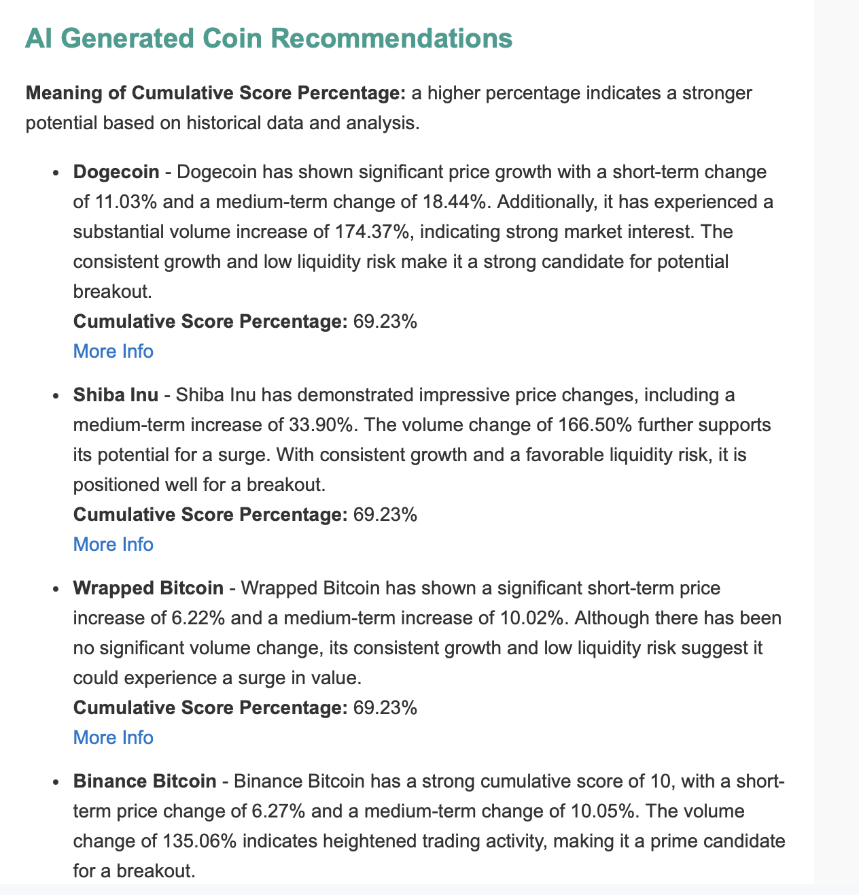

# 🐵 Crypto Monkey: Cryptocurrency Analysis & Reporting Tool
*By **Gauri Nigam***


---

## 🔍 What is Crypto Monkey?

**Crypto Monkey** is a smart, automated reporting tool that tracks the cryptocurrency market, analyzes patterns using both quantitative signals and AI, and emails you a report on the coins worth watching. It's fast, scanning thousands of coins and producing a detailed report within a day.

Powered by Python, OpenAI's GPT-4o, Santiment, and CoinPaprika APIs — it's designed to help you cut through the noise and make sense of the chaos.

---

## 🧠 What It Can Do

- 📈 **Market Trend Analysis**  
  Pulls historical price/volume data via CoinPaprika and analyzes short- and long-term trends.

- 🧪 **Santiment Intelligence**  
  Tracks developer activity, daily active addresses, and other on-chain signals.

- 📰 **News & Social Sentiment**  
  Uses VADER and GPT-4o to extract sentiment from headlines and social chatter.

- 🚀 **Surge Detection**  
  Uses a composite scoring mechanism to flag coins with breakout potential.

- 🤖 **GPT-4o Investment Suggestions**  
  Generates natural-language investment suggestions from raw data.

- 📬 **Weekly HTML Report by Email**  
  Fully automated and ready for inboxes.

- 🔁 **Reliable API Access**  
  Includes built-in retry handling for flaky requests.

---

## 📊 Full Metric Reference Table

This table outlines all the metrics analyzed for each cryptocurrency, grouped by theme and annotated with their range, usage, and description.

| **Category**        | **Metric**                            | **Key**                                   | **Range / Type**       | **Description** |
|---------------------|----------------------------------------|--------------------------------------------|-------------------------|-----------------|
| 📈 Price            | Price Change Score                     | `price_change_score`                       | 0–3                    | Momentum over short, medium, and long-term windows |
| 📈 Price            | Consistent Weekly Growth               | `consistent_growth_score`                  | 0–1                    | ≥ 4 up-days in last 7 |
| 📈 Price            | Consistent Monthly Growth              | `consistent_monthly_growth`                | 0–1                    | ≥ 18 up-days in last 30 |
| 📈 Price            | Trend Conflict                         | `trend_conflict_score`                     | 0–1                    | Monthly uptrend without short-term support |
| 📊 Volume           | Volume Change Score                    | `volume_change_score`                      | 0–3                    | Surges over 3 timeframes based on market cap/volatility |
| 📊 Volume           | Sustained Volume Growth                | `sustained_volume_growth`                  | 0–1                    | ≥ 4 volume-up days in last 7 |
| 📉 Liquidity        | Liquidity Risk                         | `liquidity_risk`                           | Low/Medium/High        | Based on 24h volume vs market cap tier |
| 💬 Sentiment        | Tweet Score                            | `tweet_score`                              | 0–1                    | Tweets found via CoinPaprika |
| 💬 Sentiment        | News Sentiment Score                   | `sentiment_score`                          | 0–1                    | VADER sentiment of news (compound > 0.5 = 1) |
| 💬 Sentiment        | Surge Keywords Score                   | `surging_keywords_score`                   | 0–1                    | Detects bullish phrases in recent news |
| 💬 Sentiment        | Fear & Greed Score                     | `fear_and_greed_score`                     | 0–1                    | Based on Alt.me index crossing threshold |
| 📰 News/Events      | Digest Mention                          | `digest_score`                             | 0–1                    | If coin is in curated Crypto Digest |
| 📰 News/Events      | Trending Score                          | `trending_score`                           | 0–2                    | Trending mentions from CryptoNewsAPI |
| 📰 News/Events      | Event Score                             | `event_score`                              | 0–1                    | Coin has events in last 7 days |
| 🧠 Santiment        | Dev Activity Increase                   | `dev_activity_increase`                    | % (0–∞)                | 30d % change in developer activity |
| 🧠 Santiment        | Active Addresses Increase               | `daily_active_addresses_increase`          | % (0–∞)                | 30d % change in unique addresses |
| 🧠 Santiment        | Exchange Inflow (USD, 1d)               | `exchange_inflow_usd`                      | USD                    | Token flow into exchanges (bearish) |
| 🧠 Santiment        | Exchange Outflow (USD, 1d)              | `exchange_outflow_usd`                     | USD                    | Token flow out of exchanges (bullish) |
| 🧠 Santiment        | Whale Transaction Count (>$100k)        | `whale_transaction_count_100k_usd_to_inf`  | Count                  | Whale trades in last 24h |
| 🧠 Santiment        | Tx Volume Change (1d)                   | `transaction_volume_usd_change_1d`         | %                      | Change in USD volume day-over-day |
| 🧠 Santiment        | Weighted Sentiment (1d)                 | `sentiment_weighted_total`                 | Score (-1 to +1)       | Weighted community + market sentiment |
| 🧠 Santiment        | Santiment Score                         | `santiment_score`                          | 0–2                    | Binary from dev + address increase |
| 🧠 Santiment        | Santiment Surge Score                   | `santiment_surge_score`                    | 0–6                    | Composite of 6 Santiment surge metrics |
| 🧠 Santiment        | Santiment Surge Explanation            | `santiment_surge_explanation`              | Text                   | Explains triggers for surge score |
| ✅ Final            | Cumulative Score                        | `cumulative_score`                         | 0–22                   | Sum of all metrics |
| ✅ Final            | Cumulative Score %                      | `cumulative_score_percentage`              | 0–100%                 | Normalized version of final score |
| 🧾 Bonus            | News Headlines                          | `coin_news`                                | List of dicts          | Top 3 recent headlines for the coin |
| 🧾 Bonus            | Full Explanation                        | `explanation`                              | String                 | Human-readable summary of metrics |

## 📬 Example Report

Each weekly email includes top-ranked coins and GPT-generated insights:



---

## ⚙️ Requirements

- Python 3.8+
- Install dependencies via:

```bash
pip install -r requirements.txt
